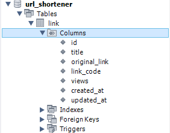

# URL Shortener (Server)

Backend of the URL Shortener application. Built with:
* Node.js (+ Express.js)
* Prisma (ORM)
* Mocha + Chai (Unit testing)
* MySQL database

## Requirements
* Node.js v18.18.0 (current LTS)

## Database Setup
Use the [database script](../database/url_shortener.sql) to create the required MySQL database for this project. 

If the script was successfully executed in your tool of choice (e.g., PHPMyAdmin, MySQL Workbench, DBeaver), you should be able to see a ```url_shortener``` database, with a ```link``` table in it.



## Project Setup (Development)
This project relies on environment variables defined in [.env](.env), such as database credentials. Confirm that the values are correct for your setup, or change them to the correct values for your use case before continuing, especially the database values which are set for to values for a Docker deployment by default.

1. Create the database as mentioned above. The REST API will not work if the database is not created correctly.
2. Navigate to the project's ```server``` folder using your terminal of choice.
3. Install the server's dependencies:
```sh
npm install
```

4. Set up Prisma ORM. The first command generates Prisma models based on the database tables, whereas the second generates the Prisma client used in the API.
```sh
npx prisma db pull
npx prisma migrate
```

5. Start the server with Nodemon (with Hot Reload for development):
```sh
npm run start
```

API documentation is then available via the ```/docs``` endpoint (e.g., http://localhost:4000/docs).

## Commands Available

### Install Dependencies
```sh
npm install
```

### Start the server with Nodemon (with Hot Reload for Development)
```sh
npm run start
```

### Set up Prisma schema and start the server (without Nodemon) - used mainly in production environment
```sh
npm run start:migrate
```

### Run tests
```sh
npm run test
```

## Folder Structure

### Prisma Schema

    ├── ...
    ├── prisma                 
    │   ├── schema.prisma       # Prisma schema generated with the commands above
    └── ...

### Source Files

    ├── ...
    ├── src                 
    │   ├── controllers         # Controller files - each file has methods to handle different API requests. For instance, linkController.js handles requests made to /links endpoints - this is configured in the routes/index.js file
    |   ├── docs                # API documentation (using Swagger with YAML)
    |   ├── routes              # API routes configuration
    |   ├── services            # Service files - each file has methods to interact with a prisma schema. For instance, linkService.js has methods to interact with the prisma link schema, which can then be reused across the controller files.
    |   ├── test                # API unit test files 
    |   ├── utils               # Utility methods to re-use across the server source files
    |   ├── app.js              # Entry point for the API server
    └── ...